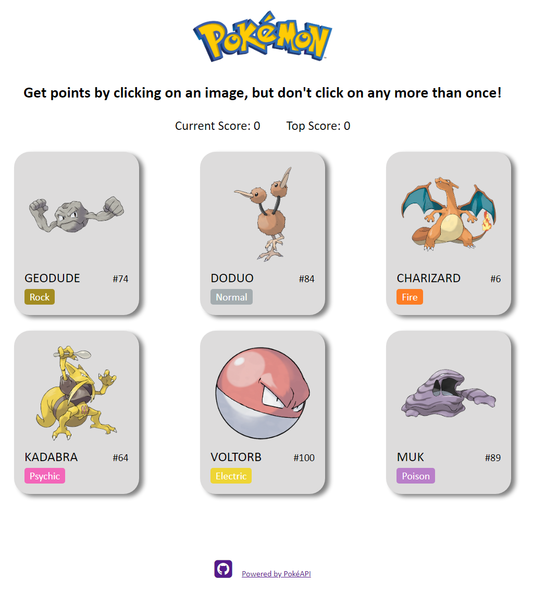

# memory_game

Memory Card game using React Hooks. Get points by clicking on a Pokémon, but don't click on any more than once!

Features:

    -Card deck features all 151 original pokemon.
    -Have fun challenging your memory while reliving your youth.

Demonstrated Skills:

    -Uses React Hooks functions like useState and useEffect to handle initialization and life cycle methods.
    -Uses the create-react-app to start the backbone of this project.
    -Uses React.js to handle all of the frontend using states, props and components with function based components.
    -Uses map() method to create the pokemon card components.

Future Ways to Improve:

    -Add a way for users to select the pokemon of a generation and have the card deck use those pokemon only.

Overall project time: ~15 hours
Date Completed: 1/24/2021

-Gary Arzumanyan

